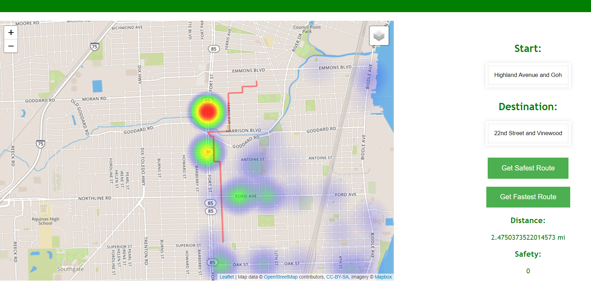

As the final project for Advanced Database Development, I teamed up with Quentin Goss under the supervision of our
shared advisor, Dr. Akbas, to create a navigation system similar to Google Maps that also took into account the safety
of the given route. The project demonstrates the idea for the city of Wyandotte, Michigan using their publicly available
crash data and uses Neo4J as the database engine. You can find the project on GitHub [here](https://github.com/kronosgreen/Safety-Navigation).

You can also look at the full research paper for more details [here](/safety-nav.pdf).

## Data

The Wyandotte crash data was collected from SEMCOG's [website](https://semcog.org/high-frequency-crash-locations) (SouthEast
Michigan Council of Governments) by Quentin Goss and entered into a PostgreSQL database. This database held three tables
for intersection data, road segment data, and a table to connect the two. Crashes in intersections being the main focus for
compiling our data on High Frequency Crash Locations, the number of crashes over the entire duration data was collected
were summed to a single value, so the higher this safety factor was, the more dangerous or more likely crashes were to happen
there.

The Open Street Map data for Wyandotte was collected by yours truly using [bbike](https://extract.bbbike.org/). To turn it
into a graph database, Python was used to parse through the OSM file which uses the XML format, and insert the nodes that
could be classified as intersections into the database. The relations in the OSM file that connected these nodes were then
added as relationships in the Neo4J database with the added property of its Cartesian distance using the endpoints' geospatial
coordinates. Using Python again, the crash data was iterated over to map out the intersections in the crash table to the
node in the Neo4J database (North-South road and East-West road were included in node's name), adding the crash value
as an additional node property.



## Safety Query

To calculate the safest route between two points, Neo4J's Graph Query Language, Cypher is used. Cypher provides a query
that returns [all shortest paths](https://neo4j.com/docs/graph-algorithms/current/labs-algorithms/all-pairs-shortest-path/)
between two points, and by optimizing for distance and safety, we can get the best route
that matches our criteria. This query returns an array of paths that each include the series of nodes or intersections that
they take, and by ordering based on our preferred trait (having the smallest safety factor), the first element in this array
was the path that we would show.

## Interface

A web interface was created using HTML and JavaScript. Leaflet, a JavaScript library, was used for the map visualization.
Both an option to optimize for distance and an option to optimize for safety were provided to show the difference between
the two. The crash data was also used to add a heat map to show where and how severe the crash locations are, which also
serves to show how optimizing for safety can affect the route provided. Since the navigation only works for the
intersections in the database, a search suggestion list was added.



The JavaScript in the web interface connects to the database instance running on my computer (at least when demoing the project)
and sends the queries, parses the response, and displays the route given by creating a line with the coordinates of each
of the intersection in the selected path. 

## Future Work

There is much potential here, as sacrificing a little bit of time to take a safer route is a trade I'm sure many would be
willing to take, especially those providing public transportation services. The demo specifically looked at one city's data,
so expanding this to a larger area would be the first step. Compiling multiple sources of data and combining them into a
single metric would also be of interest, as well as looking at the time of the incidents to navigate accordingly.
